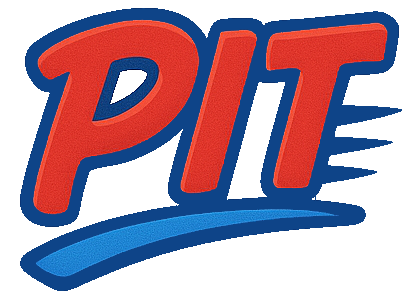
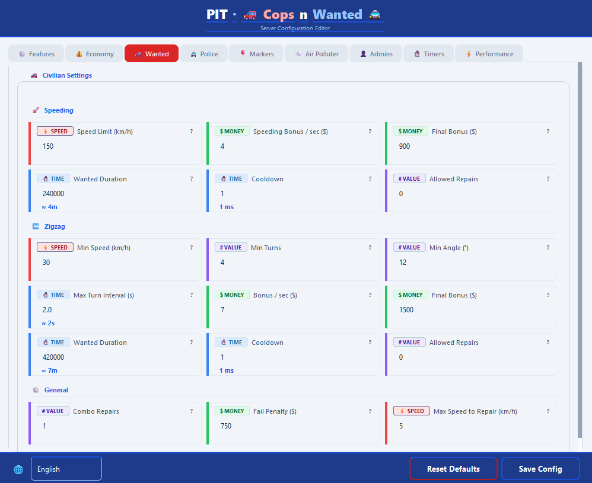

<p align="center">
  
</p>

# PIT - 🚗 Cops n Wanted 🚓

An open-source project dedicated to bringing fair, balanced, and cinematic multiplayer police chase gameplay to BeamMP

## Preview

[](https://www.youtube.com/watch?v=eaFKSADzcw8)

## Features

- **Wanted system** — speeding and zigzag violations, bust mechanic, escape system
- **Rank progression** — 5 ranks with task-based advancement for both roles
- **Repair system** — limited repairs earned through gameplay
- **Parts shop** — parts purchase system with free/banned vehicle series enforcement
- **Minimap** — real-time wanted tracking
- **Multi-language** — English, Arabic, French, German, Hebrew, Italian, Russian, Spanish
- **Performance limiter** — server-enforced vehicle rating cap with admin commands and optional community voting
- **Economy** — per-second income during chases, markers, money transfers
- **Police / Civilian roles** — detected automatically by vehicle skin
- **Multi-map** — West Coast USA, East Coast USA *(expandable to any map)*

**Optional:**
- **Air Polluter** — hidden special mission with fog effects
- **Day/Night sync** — server-controlled time cycle, requires a map with night lighting support

## Structure

Each mod consists of a server-side component and a client-side package.

| Mod | Server folder | Client package |
|-----|--------------|----------------|
| Economy / Wanted System / Parts Shop | `UIMPIT/` | `UIMPIT.zip` |
| Performance Limiter | `UIMPI/` | `UIMPI.zip` |
| Day/Night Sync *(optional)* | `MPDN/` | `MPDN.zip` |

## File Structure

<details>
<summary>Click to expand</summary>
<pre>
BeamMP-Server/
├── BeamMP-Server.exe
├── config_editor.pyw                       # Optional GUI config editor (Windows)
└── Resources/
    ├── Client/
    │   ├── UIMPIT.zip                          # Economy / Wanted System / Parts Shop
    │   │   ├── lua/ge/extensions/
    │   │   │   ├── key.lua                     # Core client logic & UI data bridge
    │   │   │   ├── minimap.lua                 # Minimap logic & rendering
    │   │   │   └── PartsShop.lua               # Parts Shop client logic
    │   │   ├── scripts/
    │   │   │   ├── EconomyUI/modScript.lua
    │   │   │   └── PartsShop/modScript.lua
    │   │   ├── settings/ui_apps/layouts/default/pit.uilayout.json
    │   │   └── ui/modules/apps/
    │   │       ├── BeamMP-PlayerList/
    │   │       │   ├── app.html
    │   │       │   ├── app.js
    │   │       │   ├── app.css
    │   │       │   ├── app.json
    │   │       │   ├── app.png
    │   │       │   └── redesign.css
    │   │       ├── EconomyHUD/
    │   │       │   ├── app.html
    │   │       │   ├── app.js
    │   │       │   ├── app.css
    │   │       │   ├── app.json
    │   │       │   └── app.png
    │   │       ├── PoliceWantedList/
    │   │       │   ├── app.html
    │   │       │   ├── app.js
    │   │       │   ├── app.css
    │   │       │   ├── app.json
    │   │       │   └── app.png
    │   │       └── PartsShop/
    │   │           ├── app.html
    │   │           ├── app.js
    │   │           ├── app.css
    │   │           ├── app.json
    │   │           └── app.png
    │   │
    │   ├── UIMPI.zip                           # Performance Limiter
    │   │   ├── lua/ge/extensions/performanceLimiter.lua
    │   │   ├── scripts/perf-ui/modScript.lua
    │   │   └── ui/modules/apps/perf/
    │   │       ├── app.html
    │   │       ├── app.js
    │   │       ├── app.css
    │   │       ├── app.json
    │   │       └── app.png
    │   │
    │   └── MPDN.zip                            # Day/Night Sync (optional)
    │       ├── lua/ge/extensions/mpdn.lua
    │       └── scripts/envsync/modScript.lua
    │
    └── Server/
        ├── UIMPIT/                             # Economy, Wanted System, Parts Shop
        │   ├── main.lua
        │   ├── schema.sql
        │   ├── modules/
        │   │   ├── AirPolluter.lua
        │   │   ├── MinimapSystem.lua
        │   │   ├── PartsShop.lua
        │   │   └── database.lua
        │   ├── config/
        │   │   ├── config.json
        │   │   ├── db.json                     # ⚠️ Never commit
        │   │   ├── SpawnLocations.lua
        │   │   ├── PoliceSkins.lua
        │   │   ├── RanksConfig.lua
        │   │   ├── parts_config.lua
        │   │   ├── free_vehicles.lua
        │   │   └── banned_vehicle_series.lua
        │   └── lang/
        │       ├── {ar,de,en,es,fr,he,it,ru}.json          # Mod translations
        │       └── editor_{ar,de,en,es,fr,he,it,ru}.json   # Config editor translations
        │
        ├── UIMPI/
        │   ├── main.lua
        │   └── config.json
        │
        └── MPDN/                               # Day/Night Sync (optional)
            └── main.lua
</pre>
</details>

## Requirements

- [BeamMP Server](https://github.com/BeamMP/BeamMP-Server)
- MySQL / MariaDB + `luasql.mysql` Lua library *(optional — falls back to local JSON storage)*

## Installation

1. Place the `UIMPIT` and `UIMPI` folders in `Resources/Server/`
2. Place `UIMPIT.zip` and `UIMPI.zip` in `Resources/Client/`
3. Restart your BeamMP server

**Optional steps:**
- Run `schema.sql` and fill in `UIMPIT/config/db.json` to enable MySQL — without this the server runs on local JSON storage automatically
- Edit `UIMPIT/config/config.json` to set your `admins` and `moderators`
- Edit `UIMPI/config.json` to set your `admins` and desired rating limit
- Place the `MPDN` folder in `Resources/Server/` and `MPDN.zip` in `Resources/Client/` to enable day/night sync — only if your map supports night lighting

## Configuration

### UIMPIT

| File | Purpose |
|------|---------|
| `config/config.json` | Gameplay settings, timers, admins |
| `config/db.json` | MySQL credentials **(never commit this file)** |
| `config/SpawnLocations.lua` | Spawn points and marker locations per map |
| `config/PoliceSkins.lua` | Vehicle skins that grant the police role |
| `config/RanksConfig.lua` | Rank names, task targets, and rewards |
| `config/parts_config.lua` | All parts with their prices (`0` = free, `>0` = purchasable, `-1` = banned) |
| `config/free_vehicles.lua` | Vehicle series that bypass the purchase system |
| `config/banned_vehicle_series.lua` | Vehicle series that are completely prohibited |

### Config Editor *(optional, Windows)*



A graphical desktop editor that manages both `UIMPIT/config/config.json` and `UIMPI/config.json` — intended for server owners who prefer not to edit JSON manually.

**Requirements:** Python 3.10+ and PySide6
```
pip install PySide6
```

**Run:** double-click `config_editor.pyw` from the server root, or:
```
python config_editor.pyw
```

On Linux, double-click may not work depending on your file manager. Run from terminal instead:
```
python config_editor.pyw
```

Reads and writes config files directly, with hover tooltips for every field.

### PerformanceLimiter

| File | Purpose |
|------|---------|
| `config.json` | Rating cap, display offset, admins, vote settings |

### DayNightSync

| File | Purpose |
|------|---------|
| `main.lua` | Cycle speed, sync interval, initial time preset |

## Storage Backends

| Backend | When active | Use case |
|---------|------------|----------|
| MySQL | `config/db.json` present and reachable | Multiple servers sharing one economy |
| JSON | `config/db.json` absent or unreachable | Single-server |

The backend is selected automatically at startup with no code changes required.

## Adding a Map

In `Resources/Server/UIMPIT/config/SpawnLocations.lua`, add an entry with the exact BeamNG map folder name:

```lua
["your_map_name"] = {
    vehicles = { ... },
    markers = { ... },
    optional_spawns = { ... },
    air_polluter_marker = { x = 0, y = 0, z = 0 },
}
```

## Community
Have questions about the mods or want to play on the server? [Join the Discord](https://discord.gg/HVKcvAJYpZ)

## Credits

- **[beamsofnorway](https://github.com/beamsofnorway)** — speed detection code reference
- **[OfficialLambdax](https://github.com/OfficialLambdax)** — day/night sync implementation (learned from published code)
- **[StanleyDudek](https://github.com/StanleyDudek)** — extensive help and published code examples that shaped much of this project

## License

| Mod | License |
|-----|---------|
| `UIMPIT` — Economy / Wanted System / Parts Shop | [AGPL-3.0](https://www.gnu.org/licenses/agpl-3.0.html) |
| `UIMPI` — Performance Limiter | [The Unlicense](https://unlicense.org) (public domain) |
| `MPDN` — Day/Night Sync | [MIT](https://opensource.org/licenses/MIT) |
