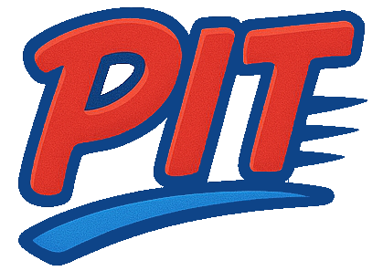
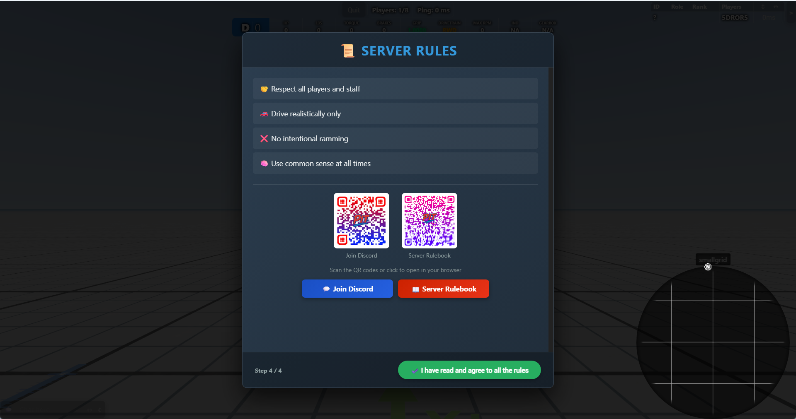
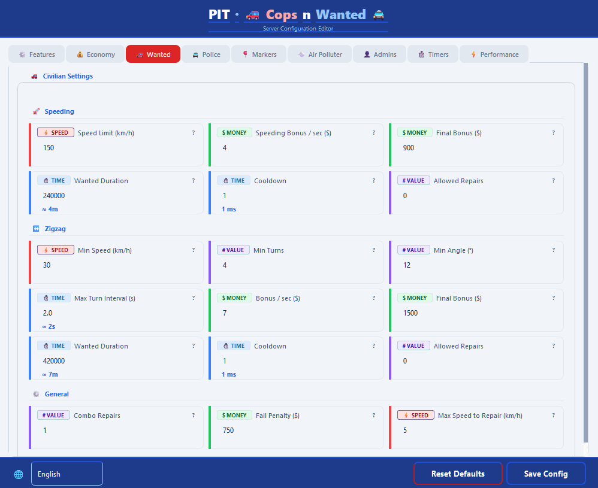

<p align="center">
  
</p>

# PIT - 🚗 Cops n Wanted 🚓

An open-source project dedicated to bringing fair, balanced, and cinematic multiplayer police chase gameplay to BeamMP

## Preview

[](https://www.youtube.com/watch?v=eaFKSADzcw8)
*▶ Click the image to watch the preview*

## Features

- **Wanted system** - speeding and zigzag violations, bust mechanic, escape system
- **Ranks & achievements** - 20 ranks earned through points, with over 140 milestones to unlock
- **Power-ups** - spike strips, banana peels and a cannon, earned during chases
- **Blocker missions** - set up roadblocks for a reward while police try to stop you
- **Repair system** - limited repairs earned through gameplay
- **Parts shop** - parts purchase system with free/banned vehicle series enforcement
- **Minimap** - real-time wanted tracking
- **Marker navigation** - on-screen arrows guiding you to the nearest repair marker
- **Rebindable keys** - every in-game action can be reassigned from BeamNG's controls menu
- **Multi-language** - Arabic, Chinese (Simplified), Czech, English, French, German, Hebrew, Hungarian, Italian, Japanese, Polish, Portuguese (Brazil), Portuguese (Portugal), Russian, Spanish, Swedish, Turkish, Ukrainian
- **Performance limiter** - server-enforced vehicle rating cap with admin commands and optional community voting
- **Economy** - per-second income during chases, markers, money transfers
- **Police / Civilian roles** - detected automatically by vehicle skin
- **Multi-map** - West Coast USA, East Coast USA *(expandable to any map)*

**Optional:**
- **Air Polluter** — hidden special mission with fog effects
- **Day/Night sync** - client-side time cycle synchronised across the server
- **Loading Screen** — custom branded loading screen with slideshow, music, and police-themed progress bar

## Structure

Each mod consists of a server-side component and a client-side package.

| Mod | Server folder | Client package |
|-----|--------------|----------------|
| Economy / Wanted System / Parts Shop | `UIMPIT/` | `UIMPIT.zip` |
| Performance Limiter | `UIMPI/` | `UIMPI.zip` |
| Day/Night Sync *(optional)* | `MPDN/` | `MPDN.zip` |
| Loading Screen *(optional)* | — | `MPLC.zip` |

## File Structure

<details>
<summary>Click to expand</summary>
<pre>
BeamMP-Server/
├── config_editor.pyw                       # Optional GUI config editor
└── Resources/
    ├── Client/
    │   ├── UIMPIT.zip                          # Economy / Wanted System / Parts Shop
    │   │   ├── art/shapes/pwu/signs/           # Power-up models, textures and sounds
    │   │   ├── lua/ge/extensions/
    │   │   │   ├── key.lua                     # Core client logic & UI data bridge
    │   │   │   ├── minimap.lua                 # Minimap logic & rendering
    │   │   │   ├── PartsShop.lua               # Parts Shop client logic
    │   │   │   ├── PartsDisplay.lua            # Prices & status in the parts menu
    │   │   │   ├── powerUpsClient.lua          # Spike strips, bananas, cannon
    │   │   │   ├── mybollard.lua               # Blocker mission bollards
    │   │   │   └── core/input/actions/
    │   │   │       └── uimpit_economy.json     # Rebindable key actions
    │   │   ├── lua/vehicle/extensions/auto/
    │   │   │   └── vehicleLuaGuard.lua
    │   │   ├── scripts/EconomyUI/modScript.lua
    │   │   ├── settings/ui_apps/layouts/default/
    │   │   │   └── pit039.uilayout.json        # Applied automatically on join
    │   │   └── ui/modules/apps/
    │   │       ├── BeamMP-Chat/
    │   │       │   ├── app.html
    │   │       │   ├── app.js
    │   │       │   ├── app.css
    │   │       │   ├── redesign.css
    │   │       │   ├── app.json
    │   │       │   └── app.png
    │   │       ├── BeamMP-PlayerList/
    │   │       │   ├── app.html
    │   │       │   ├── app.js
    │   │       │   ├── app.css
    │   │       │   ├── redesign.css
    │   │       │   ├── app.json
    │   │       │   └── app.png
    │   │       ├── BollardUI/                  # Blocker mission UI
    │   │       │   ├── app.js
    │   │       │   └── app.json
    │   │       ├── EconomyHUD/
    │   │       │   ├── app.html
    │   │       │   ├── app.js
    │   │       │   ├── app.css
    │   │       │   ├── app.json
    │   │       │   ├── app.png
    │   │       │   ├── qr_discord.png
    │   │       │   └── qr_rulebook.png
    │   │       ├── PartsShop/
    │   │       │   ├── app.html
    │   │       │   ├── app.js
    │   │       │   ├── app.css
    │   │       │   └── app.json
    │   │       └── PoliceWantedList/
    │   │           ├── app.html
    │   │           ├── app.js
    │   │           ├── app.css
    │   │           ├── app.json
    │   │           └── app.png
    │   │
    │   ├── UIMPI.zip                           # Performance Limiter
    │   │   ├── lua/ge/extensions/performanceLimiter.lua
    │   │   ├── scripts/perf-ui/modScript.lua
    │   │   └── ui/modules/apps/perf/
    │   │       ├── app.html
    │   │       ├── app.js
    │   │       ├── app.css
    │   │       ├── app.json
    │   │       └── app.png
    │   │
    │   ├── MPDN.zip                            # Day/Night Sync (optional)
    │   │   ├── lua/ge/extensions/mpdn.lua
    │   │   └── scripts/envsync/modScript.lua
    │   │
    │   └── MPLC.zip                            # Loading Screen (optional)
    │       ├── lua/ge/extensions/srs/loading.lua
    │       ├── scripts/modScript.lua
    │       └── ui/scenic_route_loading/
    │           ├── loading_config.json
    │           ├── srs_loading.css
    │           ├── srs_loading.js
    │           ├── images/                     # Slideshow images, logo, overlays
    │           └── music/
    │
    └── Server/
        ├── UIMPIT/                             # Economy, Wanted System, Parts Shop
        │   ├── main.lua
        │   ├── schema.sql
        │   ├── modules/
        │   │   ├── Achievements.lua
        │   │   ├── AirPolluter.lua
        │   │   ├── BlockerSystem.lua
        │   │   ├── MinimapSystem.lua
        │   │   ├── PartsShop.lua
        │   │   ├── PowerUpsSystem.lua
        │   │   └── database.lua
        │   ├── config/
        │   │   ├── config.json
        │   │   ├── db.example.json             # Optional - copy to db.json for MySQL
        │   │   ├── AchievementsConfig.lua
        │   │   ├── SpawnLocations.lua
        │   │   ├── PoliceSkins.lua
        │   │   ├── MessageColors.lua
        │   │   ├── parts_config.lua
        │   │   ├── free_vehicles.lua
        │   │   └── banned_vehicle_series.lua
        │   └── lang/
        │       ├── {18 languages}.json                # Mod translations
        │       └── editor_{ar,de,en,es,fr,he,it,ru}.json  # Config editor translations
        │
        ├── UIMPI/                              # Performance Limiter
        │   ├── main.lua
        │   ├── config.json
        │   └── lang/                           # 18 languages
        │
        └── MPDN/                               # Day/Night Sync (optional)
            └── main.lua
</pre>
</details>

## Requirements

- [BeamMP Server](https://github.com/BeamMP/BeamMP-Server)
- MySQL / MariaDB + `luasql.mysql` Lua library *(optional — falls back to local JSON storage)*

## Installation

1. Place the `UIMPIT` and `UIMPI` folders in `Resources/Server/`
2. Place `UIMPIT.zip` and `UIMPI.zip` in `Resources/Client/`
3. Restart your BeamMP server

**Optional steps:**
- To enable MySQL: run `schema.sql`, copy `UIMPIT/config/db.example.json` to `UIMPIT/config/db.json`, and fill in your credentials. Without this the server runs on local JSON storage automatically
- Edit `UIMPIT/config/config.json` to set your `admins` and `moderators`
- Edit `UIMPI/config.json` to set your `admins` and desired rating limit
- Place the `MPDN` folder in `Resources/Server/` and `MPDN.zip` in `Resources/Client/` to enable day/night sync
- Place `MPLC.zip` in `Resources/Client/` to enable the custom loading screen — see [Loading Screen](#loading-screen-optional) for configuration

### Upgrading from an earlier version

The `players` table gains two columns (`total_points`, `achievement_data`), added automatically at startup on both backends. On the first startup, registered players are awarded points and milestones based on their existing stats.

`db.json` is no longer in the repository. Copy `db.example.json` to `db.json` and fill it in. If you run the server from a clone, back up your `db.json` before pulling.

## Configuration

### UIMPIT

| File | Purpose |
|------|---------|
| `config/config.json` | Gameplay settings, timers, admins |
| `config/db.example.json` | Template for the MySQL settings — copy it to `db.json` and fill it in |
| `config/db.json` | Your MySQL credentials. Git-ignored, and never present in a fresh clone |
| `config/SpawnLocations.lua` | Spawn points and marker locations per map |
| `config/PoliceSkins.lua` | Vehicle skins that grant the police role |
| `config/AchievementsConfig.lua` | Points per action, rank thresholds and rewards, milestone list |
| `config/MessageColors.lua` | Controls chat message colors. Add a key to apply a color, remove it to send the message uncolored |
| `config/parts_config.lua` | All parts with their prices (`0` = free, `>0` = purchasable, `-1` = banned) |
| `config/free_vehicles.lua` | Vehicle series that bypass the purchase system |
| `config/banned_vehicle_series.lua` | Vehicle series that are completely prohibited |

### Ranks & Achievements

Ranks are earned with points instead of fixed tasks. Marker captures, busts, escapes, zigzags and combo escapes all award points, and police-role actions are worth double. There are 20 ranks from `[I]` to `[XX]`, each with a cash reward, plus over 140 milestones.

Points values, rank thresholds and the milestone list are all in `config/AchievementsConfig.lua`. To add a milestone, append an entry to the `milestones` table and add its `name_key` to every file in `lang/`.

### Power-ups

Tools hidden inside the markers that spawn on the map - players receive one as a bonus every so often.

| Power-up | Effect |
|----------|--------|
| Spike Strip | Blows out the tires of anyone who drives over it |
| Banana Peel | Makes whoever drives over it spin out |
| Cannon | Fires a cannonball at the nearest vehicle ahead |

Drop rates, hold limits and durations are at the top of `modules/PowerUpsSystem.lua`.

### Blocker Missions

A player driving a `wl40` places roadblocks for a reward that builds up as the mission progresses. Completing it pays out in full; being stopped by police hands the whole amount to whoever stopped them.

Blockade count, reward, cooldown and distance rules are at the top of `modules/BlockerSystem.lua`.

### Key Bindings

Teleports, repair, the three power-ups, marker navigation and bollards are all rebindable from **Options → Controls → Bindings** under the `PIT` entries. Defaults are in `UIMPIT.zip/lua/ge/extensions/core/input/actions/uimpit_economy.json`.

### EconomyHUD — Discord & Rulebook Links *(optional, advanced)*

The welcome screen (Step 4) supports optional buttons that open your Discord invite and server rulebook directly from inside the game.

> ⚠️ This requires editing client-side UI files. Only do this if you are comfortable with JavaScript and JSON.  

**1.** In `Resources/Client/UIMPIT.zip` → `ui/modules/apps/EconomyHUD/app.js`, set your links near the top of the file:
```javascript
var LINKS_ENABLED = true;                                // enable the buttons
var DISCORD_URL   = 'https://discord.gg/XXXXXXX';       // your Discord invite
var RULEBOOK_URL  = 'https://yoursite.com/rules';        // your rulebook URL
var SHOW_QR_CODES = false;                               // set to true if you add QR images (see below)
```

**2. *(Optional — QR codes)*** If you want QR code images to appear alongside the buttons, replace the two placeholder PNGs in the `EconomyHUD/` folder with your own:
- `qr_discord.png`
- `qr_rulebook.png`

Then set `SHOW_QR_CODES = true` in `app.js`.

### Loading Screen *(optional)*

A custom loading screen that replaces BeamNG's default with a branded slideshow, background music, and a police-themed animated progress bar.

[](https://youtu.be/sMdUT_TfHDs)
*▶ Click the image to watch the preview*

**Installation:** place `MPLC.zip` in `Resources/Client/` and restart the server. No server-side files are required.

**Configuration** is done via `ui/scenic_route_loading/loading_config.json` inside the ZIP:

| Field | Default | Description |
|-------|---------|-------------|
| `title` | `"Welcome to the server"` | Text shown in the top-right corner |
| `holdAfterLoadSec` | `0` | Seconds to keep the screen visible after loading completes |
| `slideshow.enabled` | `true` | Enable/disable the image slideshow |
| `slideshow.intervalSec` | `12` | Seconds between image transitions |
| `slideshow.fadeSec` | `3` | Cross-fade duration in seconds |
| `slideshow.shuffle` | `true` | Randomize image order |
| `slideshow.useStockImages` | `false` | Use BeamNG's built-in loading images |
| `slideshow.stockCount` | `18` | How many stock images to include (if enabled) |
| `slideshow.images` | `[...]` | List of custom image paths (JPG/PNG) |
| `music.enabled` | `true` | Enable/disable background music |
| `music.volume` | `0.45` | Playback volume (`0.0` – `1.0`) |
| `music.fadeOutMs` | `1500` | Fade-out duration in milliseconds when loading ends |
| `music.tracks` | `[...]` | List of audio file paths (MP3) |
| `music.shuffle` | `true` | Randomize track order |

**Adding your own images:** place JPG/PNG files in `ui/scenic_route_loading/images/` inside the ZIP and add their paths to `slideshow.images`.

**Adding your own music:** place MP3 files in `ui/scenic_route_loading/music/` inside the ZIP and add their paths to `music.tracks`.

**Replacing the logo:** the animated overlay is `ui/scenic_route_loading/images/LOGO.gif`. Swap the file to use your own, or remove the `#srs-logo` rule from `srs_loading.css` to hide it.

> ℹ️ The progress bar reflects real loading progress across all BeamNG loading stages and will not reach 100% until loading is fully complete.

### Config Editor *(optional, Windows)*



A graphical desktop editor that manages both `UIMPIT/config/config.json` and `UIMPI/config.json` — intended for server owners who prefer not to edit JSON manually.

**Requirements:** Python 3.10+ and PySide6
```
pip install PySide6
```

**Run:** double-click `config_editor.pyw` from the server root, or:
```
python config_editor.pyw
```

On Linux, double-click may not work depending on your file manager. Run from terminal instead:
```
python config_editor.pyw
```

Reads and writes config files directly, with hover tooltips for every field.

### PerformanceLimiter

| File | Purpose |
|------|---------|
| `config.json` | Rating cap, display offset, admins, vote settings |
| `lang/` | Interface and chat translations |

All limiter messages are translated server-side and follow each player's chosen language.

### DayNightSync

| File | Purpose |
|------|---------|
| `MPDN.zip/lua/ge/extensions/mpdn.lua` | Phase durations, reference date, drift correction |
| `MPDN/main.lua` | Server-side synchronisation |

The cycle runs client-side as phases (dawn, day, dusk) with individual durations in seconds. The server keeps clients aligned and corrects drift.

## Storage Backends

| Backend | When active | Use case |
|---------|------------|----------|
| MySQL | `config/db.json` present and reachable | Multiple servers sharing one economy |
| JSON | `config/db.json` absent or unreachable | Single-server *(the default after a fresh clone)* |

The backend is selected automatically at startup with no code changes required.

## Adding a Map

In `Resources/Server/UIMPIT/config/SpawnLocations.lua`, add an entry with the exact BeamNG map folder name:

```lua
["your_map_name"] = {
    vehicles = { ... },
    markers = { ... },
    optional_spawns = { ... },
    air_polluter_marker = { x = 0, y = 0, z = 0 },
}
```

Each marker takes a `name`, which is used to look up the announcement text. For every marker you add, add a matching `marker_spawned_at_<name>` key to each file in `Resources/Server/UIMPIT/lang/`.

## Community
Have questions about the mods or want to play on the server? [Join the Discord](https://discord.gg/HVKcvAJYpZ)

## Credits

- **[beamsofnorway](https://github.com/beamsofnorway)** — speed detection code reference
- **[OfficialLambdax](https://github.com/OfficialLambdax)** - `MPDN` was rewritten from his day/night sync implementation. The power-up code was learned from his mod, and the power-up models, textures and sounds are taken from it
- **[StanleyDudek](https://github.com/StanleyDudek)** — extensive help and published code examples that shaped much of this project
- **[Codex](https://github.com/codex-src) & MYNAMEISJEFF482** — original Scenic Route loading screen base (`srs_loading.js` / `srs_loading.css`)

## License

| Mod | License |
|-----|---------|
| `UIMPIT` — Economy / Wanted System / Parts Shop | [AGPL-3.0](https://www.gnu.org/licenses/agpl-3.0.html) |
| `UIMPI` — Performance Limiter | [The Unlicense](https://unlicense.org) (public domain) |
| `MPDN` — Day/Night Sync | [AGPL-3.0](https://www.gnu.org/licenses/agpl-3.0.html) |
| `MPLC` — Loading Screen | [MIT](https://opensource.org/licenses/MIT) |